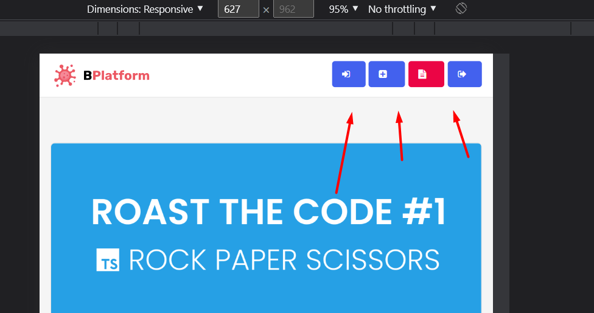
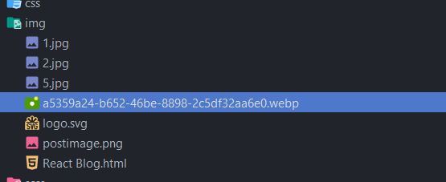

1. Отцентруй иконки

2. В некоторых html файлах написал что контекнт блока должен быть с новой строки. Проверь во всех файлах
3. Вынеси svg в файл, чтобы не мусорить в html
4. Название файла всегла kebab-case + файл react blog.html тут лишний и название некорректное  

5. Пользуйся css переменными, интсрумент очень важный и очень распространенный. У тебя в проекте их нет совсем. Например можно вынести цвета, я уверен Алексей говорил вам про это
6. Названия классов и файлов всегда пишуться в kebab-case
7. Не использовал возможности scss
8. Желательно не хранить все конструкции в одном файле (миксины, классы), лучше разносить по разным, не надо делать свалку
9. Ооооочень много копипасты, выноси её в отдельные классы или миксины и переиспользуй.
К примеру **_font-family: "Roboto", "Helvetica", "Arial", sans-serif;_** у тебя **_встречается 8 раз_**, так же с цветами, размерами шрифтов и тп
